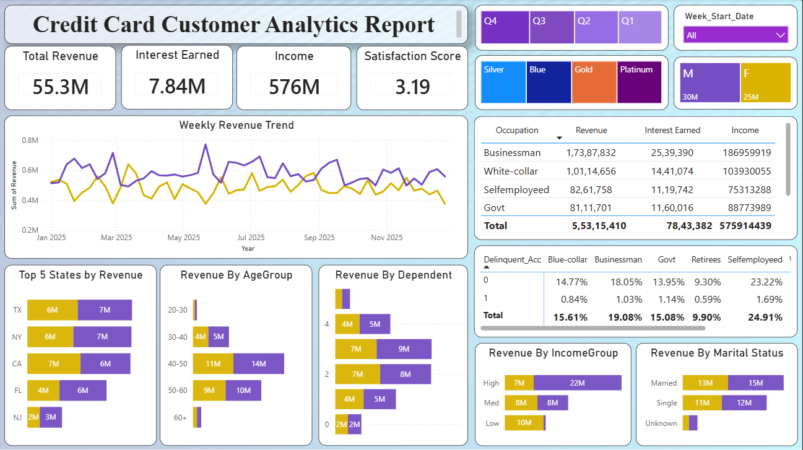
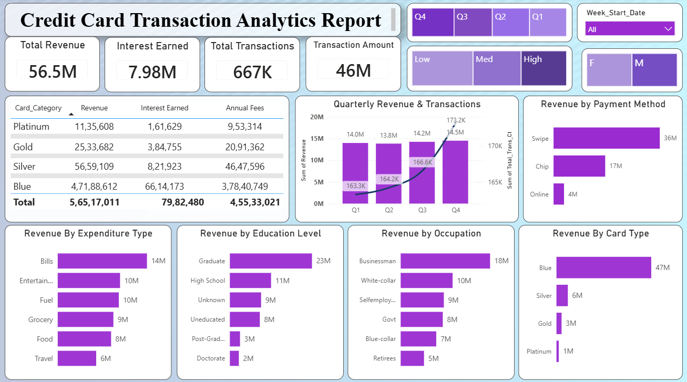

# Credit Card Customer & Transaction Analytics

A Power BI reporting solution built on a MySQL data warehouse, designed to give a credit card business a unified view of revenue, transaction activity, customer risk, and engagement.

## Business Problem

A credit card company has two kinds of data: information about its customers (age, income, job, location) and information about their card transactions (spending, revenue, missed payments). This data is usually stored in separate files, so it's hard to answer simple business questions like: Do high-income customers actually bring in more revenue? Which job types or states have the most missed payments? Which card type is really the most profitable? Every time someone wants to answer a question like this, they have to manually combine the two files and go through the numbers again. This project fixes that by loading both files into one database, connecting them by customer ID, and building a Power BI report on top. Now these questions can be answered by filtering a dashboard instead of redoing the work each time.

## Target Users

- Business and finance teams tracking revenue and interest performance
- Marketing and product teams segmenting customers by demographics, income, and card category
- Risk and credit teams monitoring activation and delinquency rates
- Leadership reviewing overall portfolio health

## Business Insights

The Credit Card Analytics Dashboard provides an executive-level view of customer behavior, transaction performance, revenue generation, and portfolio health. Built in Power BI, it lets stakeholders monitor KPIs, identify revenue drivers, and support data-driven decisions across the business.



### Executive Summary

**Week-over-Week Performance**
Revenue increased by 28.8% compared to the previous week, indicating positive business growth. During the same period, total transaction amount increased by 35.0%, transaction count increased by 3.4%, and customer count increased by 12.8%, reflecting improved customer engagement and spending activity.

**Year-to-Date Performance**
- Total Revenue: 56.5M
- Interest Earned: 7.98M
- Total Transaction Amount: 46M
- Total Transactions: 667K
- Customer Income: 588M
- Average Customer Satisfaction Score: 3.19 / 5

### Revenue & Customer Insights

- Male customers generated approximately 54% of total revenue (31M), while female customers contributed around 46% (26M), highlighting a slightly stronger spending pattern among male cardholders.
- Blue and Silver credit cards account for approximately 94% of total transaction revenue, making them the primary revenue-generating products despite being entry-level card offerings.
- Gold and Platinum cards contribute a comparatively smaller share, presenting an opportunity to improve premium card adoption and customer upgrades.

### Geographic Performance

Revenue is concentrated across a few high-performing states — Texas, New York, and California — which together contribute approximately 69% of overall revenue, indicating strong regional concentration and potential opportunities for market expansion into lower-performing regions.

### Customer Segmentation Insights

The dashboard enables revenue analysis across multiple customer dimensions:
- Business professionals represent the highest revenue-generating occupation.
- Customers aged 40–60 years contribute the largest share of revenue.
- Graduate degree holders generate the highest revenue among education groups.
- High-income customers contribute significantly more revenue than medium- and low-income segments.
- Married customers slightly outperform single customers in overall spending.

These insights support targeted marketing campaigns and customer segmentation strategies.



### Transaction Insights

- Swipe transactions account for the vast majority of payment revenue, significantly outperforming Chip and Online payment methods.
- Spending is concentrated in essential categories such as Bills, Entertainment, Fuel, Grocery, and Food, providing valuable insight into customer purchasing behavior.

### Portfolio Health

- Card Activation Rate: 57.5%
- Overall Delinquency Rate: 6.06%

While the activation rate indicates healthy customer onboarding, nearly 42% of issued cards remain inactive, highlighting an opportunity to improve activation campaigns. The delinquency rate provides a baseline credit risk metric for ongoing portfolio monitoring.

### Business Recommendations

- Increase marketing efforts for Gold and Platinum cards to improve premium product adoption.
- Launch customer activation campaigns to increase first-time card usage.
- Focus customer retention initiatives on high-value regions such as Texas, New York, and California.
- Expand digital payment incentives to encourage greater adoption of online transactions.
- Develop personalized offers for high-income and middle-aged customer segments to maximize revenue growth.
- Monitor delinquency trends regularly to proactively manage credit risk and maintain portfolio quality.

## Tools Used

- MySQL — data storage and modeling
- Power BI — data connection, DAX, and visualization

## Repository Structure

```
dataset/    raw CSV files
sql/        database setup and import script
reports/    Power BI dashboard screenshots
README.md
```

## Author

**Tejas Salunkhe**  
Aspiring Data Analyst 

- GitHub: [github.com/TejasML](https://github.com/Codec-Tejas)
- LinkedIn: [linkedin.com/in/tejas-salunkhe05](https://linkedin.com/in/tejas-salunkhe05)
- Email: salunkhetejas501@gmail.com